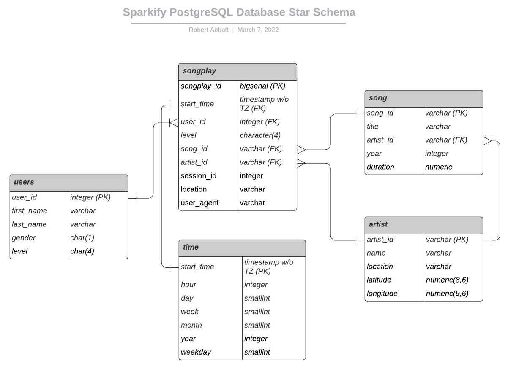

# Project: Data Modeling with Postgres

## Using a Star Schema Model, Create a Postgres Database and ETL Pipleine for Sparkify Music Streaming App

### Summary

A startup called Sparkify wants to analyze the data they've been collecting on songs and user activity on their new music streaming app. The analytics team is particularly interested in understanding what songs users are listening to. Currently, they don't have an easy way to query their data, which resides in a directory of JSON logs on user activity on the app, as well as a directory with JSON metadata on the songs in their app.

They'd like to create a Postgres database with tables designed to optimize queries on song play analysis. A database schema and ETL pipeline will need to be created for this analysis accordingly. The database and ETL pipeline will be tested by running queries given by the analytics team from Sparkify to produce the expected results.

### Files in the Repository

The following files can be found in the repository root directory:

#### Python Scripts

1. **sql_queries.py** - This Python script file contains all the queries used to define (create) the database tables and to manipulate (insert) the data.  Each individual query is stored as a Python string variable.  The DROP and CREATE query types are each aggregated into a Python list variable.  
2. **create_tables.py** - This Python script file defines functions for the following:
    1. Creating (or re-creating) the "sparkify" database that will receive all the data from the source JSON files.
    2. Dropping all tables, if they exist.
    3. Creating all tables that do not already exist.
The create_tables.py script imports the DROP and CREATE list objects from sql_queries.py which are used to define their associated functions. The Python PostgreSQL API "psycopg2" is also imported and used to connect to the sparkify database and execute queries.  
3. **etl.py** - This Python script file defines functions for the following:
    1. Importing JSON source files containing **song** data, manipulating the data when necessary, and loading it into the sparkify database.
    2. Importing JSON source files containing **log** data, manipulating the data when necessary, and loading it into the sparkify database.
    3. Connecting to the sparkify database and calling the above two functions to process the JSON data files.

#### Jupyter Notebooks

1. **etl.ipynb** - Contains sample code, instructions, and guidance, that was used to define the ETL pipeline piece by piece for each of the tables in the sparkify database. Once completed, these pieces were assembled to create the etl.py file that extracts the song and log datasets from the source JSON files, transforms the data as needed, and loads it into the sparkify database.
2. **test.ipynb** - This notebook was used to confirm each piece of the ETL pipeline was functioning as expected.  It uses the Jupyter magic syntax to load the sql extention used to connect to and interact with the database. It uses predefined queries limited in size to make quick verifications as well as more complex queries designed to verify column data types and referential integrity between tables.

#### Log Files

1. **artist_record.log** - Optional log file generated by the etl.process_song_file function when loading into the artist table.  Used for evaluating data integrity and query troubleshooting.
2. **song_record.log** - Optional log file generated by the etl.process_song_file function when loading into the song table.  Used for evaluating data integrity and query troubleshooting.
3. **time_record.log** - Optional log file generated by the etl.process_log_file function when loading into the time table.  Used for evaluating data integrity and query troubleshooting.

The log file code is commented with DOCSTRING as follows:

```bash
'''Remove DOCSTRING comments to enable logging
# start log
...
'''
# continue log
'''
# end log
'''
```

Removing the DOCSTRING encoding ''' will enable logging *(NOTE: It's recommended to leave the # comments)*.
The log files are appended, so one may wish to start fresh by deleting the log files from command line before running etl.py with logging.

### How to Run the Python Scripts

#### Option 1 - Using Terminal Command Line

1. From the Launcher tab (File -> New Launcher), start a new Terminal session.
2. From the command line, execute the "create_tables.py" and "etl.py" Python scripts as follows:

    ```bash
    root@5e655725dd54:/home/workspace# python create_tables.py
    root@5e655725dd54:/home/workspace# python etl.py
    71 files found in data/song_data
    1/71 files processed.
    2/71 files processed.
    3/71 files processed.
    ...
    30 files found in data/log_data
    1/30 files processed.
    2/30 files processed.
    3/30 files processed.
    ...
    28/30 files processed.
    29/30 files processed.
    30/30 files processed.
    root@5e655725dd54:/home/workspace#
    ```

#### Option 2 - Using Jupyter Notebook "etl.ipynb"

1. Open the etl.ipynb notebook, scroll to the bottom.
2. Under the heading "Implement etl.py", in the empty cell enter:

    ```bash
    !python create_tables.py
    ```

    > NOTE: The above command may already exist and if so, just run the cell. If there is no empty cell, click to hightlight the bottom-most text and then click the "+" button on the notebook toolbar to "Insert a cell below".

3. Once the create_tables.py script has completed, click the "+" button on the notebook toolbar to "Insert a cell below".

    > NOTE: The below command may already exist and if so, just run the cell.

4. In the new cell enter:

    ```bash
    !python etl.py
    ```

    You should see output to screen resembling the following:

    ```bash
    71 files found in data/song_data
    1/71 files processed.
    ...
    71/71 files processed.
    30 files found in data/log_data
    1/30 files processed.
    ...
    30/30 files processed.
    ```

### How to Test/Verify the Results

1. Open the test.ipynb notebook and click to highlight the top cell:

    ```bash
    %load_ext sql
    ```

2. From the Jupyter "Run" menu, select "Run selected cell and all below".
3. Scroll down the notebook to verify that all queries executed successfully and returned the expected result.

### Database Schema Design and ETL Pipeline Justification

#### Entity Relationship Diagram of the sparkifydb Database and Brief Commentary on ETL



This is a Star schema configuration.  The "songplay" and "time" tables serve as Fact Tables in this schema and the rest are Dimension Tables.

While completing the etl.py script, I found it necessary to change the order of operations in the process_song_file function. It had been set up so that the song table was loaded first.  However, with the Foreign Key constraint in place on the song.artist_id field, the song table insert statements would fail the refrerential integrity check if the artist table had not first been populated.  I therefore moved the artist_table_insert operaton first.

As I further tuned the foreign key relations, I also found it necessary to shuffle the order of queries in the create_table_queries list in the sql_queries.py so as to avoid violating various refrerential integrity constraints. This made it so certain tables were created before others, satisfying the order of dependency.

I found that four of the five table insertion queries required ON CONFLICT ON CONSTRAINT DO NOTHING clauses to avoid duplicating records.  For instance, the log data potentially contains multple plays by the same user, but the "user" table only need retain one record per user, and so only unique user records need be inserted and the duplicates ignored (DO NOTHING). The exception was the "songplay" table, which did not rely on a "natural" Primary Key originating in the data (e.g. user_id), instead generating it's own key values in serial as new records were added to the database (this is done by the songplay_id column's ***bigserial*** data type). The log data itself contains sufficient unique data points across each record that there is no potential for duplicate records to be inserted into the "songplay" table.

#### Descriptions of Each Table from the sparkifydb Schema

> NOTE: For each table depicted below there is a description underneath.

```bash
          List of relations
 Schema |   Name   | Type  |  Owner  
--------+----------+-------+---------
 public | artist   | table | student
 public | song     | table | student
 public | songplay | table | student
 public | time     | table | student
 public | users    | table | student
(5 rows)
```

This is the list of tables (relations) in the sparkifydb database.

```bash
                                          Table "public.songplay"
   Column    |            Type             |                           Modifiers           
                 
-------------+-----------------------------+-----------------------------------------------
-----------------
 songplay_id | bigint                      | not null default nextval('songplay_songplay_id
_seq'::regclass)
 start_time  | timestamp without time zone | not null
 user_id     | integer                     | not null
 level       | character(4)                | 
 song_id     | character varying           | 
 artist_id   | character varying           | 
 session_id  | integer                     | 
 location    | character varying           | 
 user_agent  | character varying           | 
Indexes:
    "songplay_pkey" PRIMARY KEY, btree (songplay_id)
Foreign-key constraints:
    "songplay_artist_id_fkey" FOREIGN KEY (artist_id) REFERENCES artist(artist_id)
    "songplay_song_id_fkey" FOREIGN KEY (song_id) REFERENCES song(song_id)
    "songplay_start_time_fkey" FOREIGN KEY (start_time) REFERENCES "time"(start_time)
    "songplay_user_id_fkey" FOREIGN KEY (user_id) REFERENCES users(user_id)
```

The "songplay" table is the fact table in this star schema. There are four Foreign Keys and one Primary Key for this table.  The songplay_id Primary Key field value is generated automatically in serial sequence whenever a new record is added.  Duplicates are not permitted in this field. Both the song.song_id and artist_artist_id Primary Key fields are referenced by the corresponding songplay.song_id and songplay.artist_id Foreign Key fields respectively in a one-to-many relationship (i.e. one song can have many plays, and one artist can be associated with many song plays).

The "start_time" column contains the log file timestamp field values \[UNIX epoch time\] that were transformed by the Pandas package to datetime format in the songplay_table_insert ETL to the songplay.start_time field.

I made the songplay table songplay_id field a "bigserial" data type. This data type auto-increments and accomodates over 2^31 records (or from 1 to 9223372036854775807).  I figured that since this project data is a subset of a much larger dataset and already the songplay table contains 6820 records, it makes sense to allow for maximum capacity.  Also, it stands to reason that tracking all song plays across all Sparkify users will require maximum capacity.

```bash
                 Table "public.time"
   Column   |            Type             | Modifiers 
------------+-----------------------------+-----------
 start_time | timestamp without time zone | not null
 hour       | integer                     | 
 day        | smallint                    | 
 week       | smallint                    | 
 month      | smallint                    | 
 year       | integer                     | 
 weekday    | smallint                    | 
Indexes:
    "time_pkey" PRIMARY KEY, btree (start_time)
Referenced by:
    TABLE "songplay" CONSTRAINT "songplay_start_time_fkey" FOREIGN KEY (start_time) REFERENCES "time"(start_time)
```

In the "time" Dimension table, the Primary Key "start_time" has a one-to-one relationship with the songplay.start_time Foreign Key field. The "start_time" column contains the log file timestamp field values \[UNIX epoch time\] that were transformed by the Pandas package to datetime format in the time_table_insert ETL to time.start_time (and also by the songplay_table_insert into the corresponding songplay.start_time field).

```bash
           Table "public.artist"
  Column   |       Type        | Modifiers 
-----------+-------------------+-----------
 artist_id | character varying | not null
 name      | character varying | not null
 location  | character varying | 
 latitude  | double precision  | 
 longitude | double precision  | 
Indexes:
    "artist_pkey" PRIMARY KEY, btree (artist_id)
Referenced by:
    TABLE "song" CONSTRAINT "song_artist_id_fkey" FOREIGN KEY (artist_id) REFERENCES artist(artist_id)
    TABLE "songplay" CONSTRAINT "songplay_artist_id_fkey" FOREIGN KEY (artist_id) REFERENCES artist(artist_id)
```

Note the foreign key constraints from the "song" and "songplay" tables.  Also, the "name" column cannot be NULL.

```bash
            Table "public.song"
  Column   |       Type        | Modifiers 
-----------+-------------------+-----------
 song_id   | character varying | not null
 title     | character varying | not null
 artist_id | character varying | 
 year      | integer           | 
 duration  | numeric           | not null
Indexes:
    "song_pkey" PRIMARY KEY, btree (song_id)
Foreign-key constraints:
    "song_artist_id_fkey" FOREIGN KEY (artist_id) REFERENCES artist(artist_id)
Referenced by:
    TABLE "songplay" CONSTRAINT "songplay_song_id_fkey" FOREIGN KEY (song_id) REFERENCES song(song_id)
```

The artist.artist_id Primary Key is referenced by the song.artist_id Foreign Key in a one to many relationship (i.e. one song can have only one artist. *NOTE: It should be possible for one song to have multiple artists [e.g. in a duet], but it's not clear how that might be implemented by this data set*). The "title" and "duration" columns cannot be NULL.

```bash
            Table "public.users"
   Column   |       Type        | Modifiers 
------------+-------------------+-----------
 user_id    | integer           | not null
 first_name | character varying | 
 last_name  | character varying | 
 gender     | character(1)      | 
 level      | character(4)      | 
Indexes:
    "users_pkey" PRIMARY KEY, btree (user_id)
Referenced by:
    TABLE "songplay" CONSTRAINT "songplay_user_id_fkey" FOREIGN KEY (user_id) REFERENCES users(user_id)
```

I chose to specify precise character data types for gender and level, which seemed the most efficient for these simple values. Note that the level field data type matches that of songplay.level.  The user.user_id field is referenced by the songplay.user_id Foreign Key in a one-to-many relationship (i.e. one user can play many songs, but one song play can have only one user).

### Example Queries and Results for Song Play Analysis

1. What songs are users listening to most? *(N/A - Because there is only one song play record in the songplay table containing a song_id value, it's not possible to link more than one song play with a user and so the result of such a query would be irrelevant)*

2. What time of day do users listen most? *In the query result below, it's clear that users listen most often on Thursday (weekday 4) between the hours of 3:00PM and 9:00PM (during hours 15 - 18).*

    ```bash
    SELECT weekday, hour, COUNT(hour) as "plays/hr" FROM time GROUP BY weekday, hour ORDER BY "plays/hr" DESC LIMIT 10;

    weekday | hour | plays/hr 
    ---------+------+----------
        4 |   16 |      140
        4 |   15 |      121
        1 |   20 |      115
        4 |   18 |      107
        4 |   17 |      107
        2 |    9 |      104
        0 |   15 |       99
        1 |   19 |       94
        3 |   18 |       93
        3 |   16 |       91
    (10 rows)
    ```

3. Which users are spending the most time listening? ***(NOTE: This example produces only one record because there is only one song play record in the songplay table containing a song_id value)***

    ```bash
    SELECT u.user_id, u.first_name, u.last_name, SUM(s.duration) AS listen_time FROM users u JOIN songplay sp ON u.user_id = sp.user_id JOIN song s ON sp.song_id = s.song_id GROUP BY u.user_id ORDER BY listen_time;

    user_id | first_name | last_name | listen_time 
    ---------+------------+-----------+-------------
        15 | Lily       | Koch      |   269.58322
    ```

4. Which artists are most popular? ***(NOTE: This example produces only one record because there is only one song play record in the songplay table containing an artist_id value)***

    ```bash
    SELECT a.artist_id, a.name, COUNT(sp.artist_id) num_artist_plays FROM songplay sp JOIN artist a ON sp.artist_id = a.artist_id GROUP BY a.artist_id ORDER BY num_artist_plays;

        artist_id      | name  | num_artist_plays 
    --------------------+-------+------------------
    AR5KOSW1187FB35FF4 | Elena |                1
    (1 row)
    ```

5. Which songs are most popular? ***(NOTE: This example produces only one record because there is only one song play record in the songplay table containing a song_id value)***

    ```bash
    SELECT a.name, s.title, s.year, COUNT(sp.song_id) AS num_song_plays FROM songplay sp JOIN song s ON sp.song_id = s.song_id JOIN artist a ON sp.artist_id = a.artist_id GROUP BY a.name, s.title, s.year ORDER BY num_song_plays;

    name  |     title      | year | num_song_plays 
    -------+----------------+------+----------------
    Elena | Setanta matins |    0 |              1
    (1 row)
    ```

6. Locations where songs are played most often? *Songs are played most often in San Fransciso, with Sacremento ranked 10th*

    ```bash
    SELECT location, COUNT(location) AS plays_per_location FROM songplay GROUP BY location ORDER BY plays_per_location DESC LIMIT 10;

                    location                 | plays_per_location 
    -----------------------------------------+--------------------
    San Francisco-Oakland-Hayward, CA       |                691
    Portland-South Portland, ME             |                665
    Lansing-East Lansing, MI                |                557
    Chicago-Naperville-Elgin, IL-IN-WI      |                475
    Atlanta-Sandy Springs-Roswell, GA       |                456
    Waterloo-Cedar Falls, IA                |                397
    Lake Havasu City-Kingman, AZ            |                321
    Tampa-St. Petersburg-Clearwater, FL     |                307
    San Jose-Sunnyvale-Santa Clara, CA      |                292
    Sacramento--Roseville--Arden-Arcade, CA |                270
    (10 rows)
    ```
